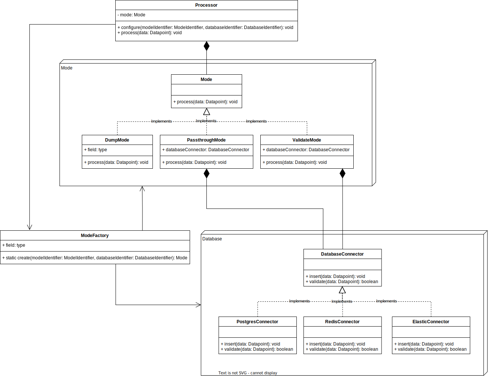

# Walmart Advanced Software Engineering Virtual Experience

## Task 1: Advanced Data Structures
Implement a novel version of a heap.
### Background
The Walmart Shipping Department is implementing a new system which depends on a priority queue. Since the queue represents a potential bottleneck in the system, much thought is being put into selecting the right data structure for the job. Many options have been proposed, and the plan is to benchmark each one in order to pick the best option.   
Your task is to implement one of the proposed data structures: a slightly modified heap. The heap must satisfy the heap property, but rather than a traditional binary heap, each parent node in this heap will have 2^x children. Since the goal is to benchmark the most common operations on the data structure, you will only be responsible for implementing two methods - insert, and pop max. Think carefully about what parts of the heap need to change, and how those changes will affect the rest of the heap’s behavior.

### To-do
Your task is to implement a novel data structure - your project lead is calling it a power of two max heap. The rest of your team is doing their best to come up with a better name. The requirements of the data structure are as follows:

- [x] The heap must satisfy the heap property.
- [x] Every parent node in the heap must have 2^x children.
- [x] The value of x must be a parameter of the heap's constructor.
- [x] The heap must implement an insert method.
- [x] The heap must implement a pop max method.
- [x] The heap must be implemented in Java.
- [x] The heap must be performant.
- [x] You must use a more descriptive variable name than x in your implementation.  

Think carefully about how you implement each method, and manage the underlying data. Performance is critical, so keep cycles and memory usage to a minimum. Be sure to test your heap with very small and very large values of x. As always, keep a weather eye out for sneaky edge cases.

 

## Task 2: Software Architecture
Design a system which satisfies complex business requirements.
### Background
After much deliberation amongst your team, you have been trusted to design part of a new data processing pipeline. You will be responsible for coming up with the architecture for a dynamically reconfigurable data processor. The processor will have several different modes, each of which treats incoming data in a different way. Some modes will pass the result along to a database, and others will additionally validate the data against the database. To further complicate matters, there are several databases in play, and the processor needs the ability to toggle between them on the fly. The system needs to be extendable - your team has every intention of adding additional modes and databases in the future - so take extra care to ensure the system isn't rigid. Adhere to good design principles, use design patterns where they make sense, and remember your SOLID principles. Your project lead will use this to assess your ability to design clean code, so be sure to show off what you know. Success here could mean a promotion, don't squander the chance!

### To-do
Your task is to draft a UML class diagram describing the data processors for a pipeline. The component responsible for reading in input data is being designed by another engineer, so you only need to worry about what happens to the data when it reaches your processor. You may assume three classes already exist:   

- `Datapoint`: this class represents both raw and processed data points. Any time data moves between methods you may use this class as an abstraction.
- `ModeIdentifier`: an enum used to identify a processor mode.
- `DatabaseIdentifier`: an enum used to identify a database connection.

Here are the requirements for your design:

- [x] The processor must implement a `configure` method that accepts a `ModeIdentifier` and a `DatabaseIdentifier` as parameters. 
- [x] This method is called to change the operating mode of the processor, and/or select the current database.
- [x] The processor must be able to change between the following modes:
    - Dump mode: simply drops the data.
    - Passthrough mode: inserts the data into the currently configured database.
    - Validate mode: validates the data, then inserts it (both operations are carried out on the currently configured database).

- [x] The processor must be able to swap between the following databases. Each database will require a different implementation to insert and validate data
    - Postgres.
    - Redis.
    - Elastic.

- [x] The processor must implement a process method that accepts a `DataPoint` as a parameter.
This method will have different behavior depending on the currently configured mode and database.

There is no need to get into implementation specifics, keep things abstract and high level. For example, you need only specify connect, insert, and validate methods for each database, there is no need to specify how those methods go about performing their verbs. The point of this task is to think about how code is structured. 

### *My Solution:*

 

## Task 3: Relational Database Design
Design a relational database to satisfy a complex collection of requirements.
### Background
The Walmart pet department has decided to combine its numerous databases into a single source of truth. The centralized database will save much time and effort when it comes to querying the data and collecting metrics. They just got approval to begin the project, so now it's up to your team to begin putting the database together. The first step is to figure out the database schema. You have been selected to design the database, and are expected to have the first draft of an ERD completed shortly. The pet department has sent over a list of requirements the design must satisfy and are eager to get started.

### To-do
Your task is to draft a UML class diagram describing the data processors for a pipeline. The component responsible for reading in input data is being designed by another engineer, so you only need to worry about what happens to the data when it reaches your processor. You may assume three classes already exist:

- `Datapoint`: this class represents both raw and processed data points. Any time data moves between methods you may use this class as an abstraction.

- `ModeIdentifier`: an enum used to identify a processor mode.

- `DatabaseIdentifier`: an enum used to identify a database connection.

Your task is to draft an ERD for an appropriately normalized relational database that satisfies these requirements:

- [x] The database should store information related to the following `products`.
    - Pet `food`, which has a name, manufacturer, weight, flavor, and target health condition.
    - Pet `toys`, which have an associated material, name, manufacturer, and durability.
    - Pet `apparel`, which has a color, manufacturer, size, name, and specific care instructions.
- [x] Each product should be associated with one or more `animals`.
- [x] Each product should be associated with a `manufacturer`.
- [x] The database should track `customers` and their `transactions`.
    - It should store customer names and email addresses.
    - Customers can make transactions to purchase one or more products.
    - Each transaction should store the date and the products involved.
- [x] The database should track `shipments` to various Walmart locations.
    - Each `location` should be represented by a name and a zip code.
    - A shipment is recorded as an origin, a destination, and a collection of products, each with an associated quantity.

### *My Solution:*

 

## Task 4: Data Munging
Populate a database with a large quantity of data in disparate formats.
### Background
Your team has been tasked with collecting metrics on a plethora of disparate shipping data. This task comes straight from the top, so it would be wise to give it your all. The data is contained in a number of different spreadsheets, each with its own competing schema. In order to interrogate the data, all of it has to be in the same place and in the same format. Currently, the shipping data exists in several places in several formats and is therefore impossible to query. To combine the spreadsheets, you need to write a python script to read through every row, extract the pertinent data, figure out how to combine it, munge it into the right format, and upload it to the database. Plenty of steps, but the resulting data will be much easier to query. Once the database contains all the data, you can pass it off to the analysis team to extract all the relevant metrics. 

### To-do
Your task is to insert all of the data contained in the provided spreadsheets into the SQLite database.   

You will write a Python script which:

- [x] Reads each row from the spreadsheets.
- [x] Extracts the relevant data.
- [x] Munges it into a format that fits the database schema.
- [x] Inserts the data into the database.

Spreadsheet 0 is self contained and can simply be inserted into the database, but spreadsheets 1 and 2 are dependent on one another. Spreadsheet 1 contains a single product per row, you will need to combine each row based on its shipping identifier, determine the quantity of goods in the shipment, and add a new row to the database for each product in the shipment. The origin and destination for each shipment in spreadsheet 1 are contained in spreadsheet 2. 

You may assume that all the given data is valid - product names are always spelled the same way, quantities are positive, etc. 